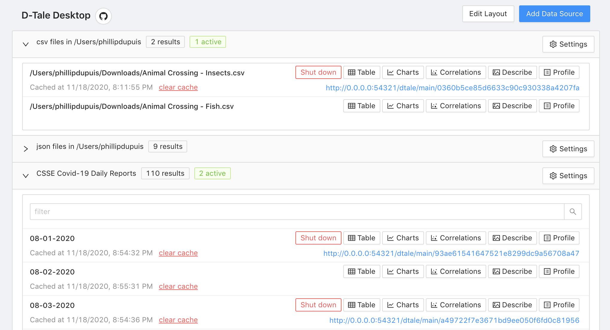

---
An interface for saving python scripts as permanent D-Tale launch points.

[](https://badge.fury.io/py/dtaledesktop)
[](https://github.com/psf/black)

---
### Getting started

#### Installation
```bash
$ pip install dtaledesktop
```

#### Running it from the command line:
```bash
$ dtaledesktop
```

#### Running it from a python script:
```
import dtale_desktop

dtale_desktop.run()
```

---
### Motivation

[D-Tale (or dtale)](https://github.com/man-group/dtale) is an extremely powerful and versatile tool for exploratory analysis of pandas dataframes.

D-Tale Desktop builds on this by providing an interface which simplifies the process of fetching data, cleaning/transforming it, and *then* feeding it into D-Tale. You can save snippets of arbitrary python code for fetching/transforming data as permanent "entries", and you will then be able to execute that code and open dtale at any time by simply clicking a button.

Side note, this is also a working example of how you can serve d-tale alongside another app in kubernetes. Will provide an example soon, that's a todo.

---
### How it works

The front end is written with react. State is managed via useReducer, for no particular reason other than that I wanted to try it out (instead of redux).

The back end actually consists of TWO apps - the main application (built using FastAPI) and the D-Tale application. These applications listen on separate ports. The main application allows users to write or edit code in real-time, and it is able to do this by saving the submitted code as persistent files and then using importlib.util to build and then import the resulting modules.

---
### Settings

#### Disabling features:
|Environment Variable|Description|
|:----------|:-----------|
|DTALEDESKTOP_DISABLE_ADD_DATA_SOURCES|"true" if the "Add Data Source" button should not be shown.|
|DTALEDESKTOP_DISABLE_EDIT_DATA_SOURCES|"true" if editing existing data sources should not be allowed.|
|DTALEDESKTOP_DISABLE_EDIT_LAYOUT|"true" if users should not be allowed to edit what sources are visible or what order they're in.|
|DTALEDESKTOP_DISABLE_PROFILE_REPORTS|"true" if the "Profile" option (which builds a pandas_profiling report) should not be shown. This is resource-intensive and currently a bit buggy.|
|DTALEDESKTOP_DISABLE_OPEN_BROWSER|"true" if browser should not open upon startup|
|DTALEDESKTOP_DISABLE_DTALE_CELL_EDITS|"true" if editing cells in dtale should be disabled.|

#### Routing requests:
|Environment Variable|Description|
|:----------|:-----------|
|DTALEDESKTOP_HOST|host it will run on|
|DTALEDESKTOP_PORT|port the main application will use|
|DTALEDESKTOP_DTALE_PORT|port the dtale application will use|
|DTALEDESKTOP_ROOT_URL|allows you to override how urls are built, which can be useful if you're running it as a service (ie not locally)|
|DTALEDESKTOP_DTALE_ROOT_URL|added in order to support running dtaledesktop in k8s - by using different domain names for the main app and the dtale app, the ingress controller can use that (domain name) to determine which port requests should be sent to.|
|DTALEDESKTOP_ENABLE_WEBSOCKET_CONNECTIONS|"true" if real-time updates should be pushed to clients via websocket connection. This is only useful/necessary if you are running it as a service and multiple users can access it simultaneously.|

#### Loaders/file storage:
|Environment Variable|Description|
|:----------|:-----------|
|DTALEDESKTOP_ROOT_DIR|the location where all persistent data (loaders, cached data, etc.) will be stored. By default this is ~/.dtaledesktop|
|DTALEDESKTOP_ADDITIONAL_LOADERS_DIRS|comma-separated list of directory paths that should be scanned for data sources upon startup|
|DTALEDESKTOP_EXCLUDE_DEFAULT_LOADERS|"true" if the default loaders should not be included in the list of data sources. These are the loaders which look for json, csv, and excel files in your home directory.|
---